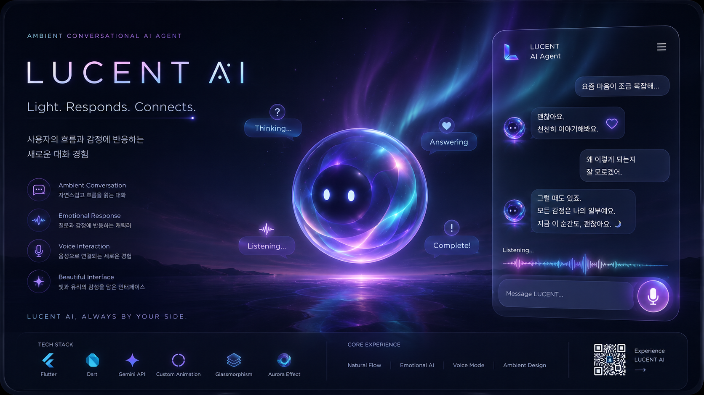
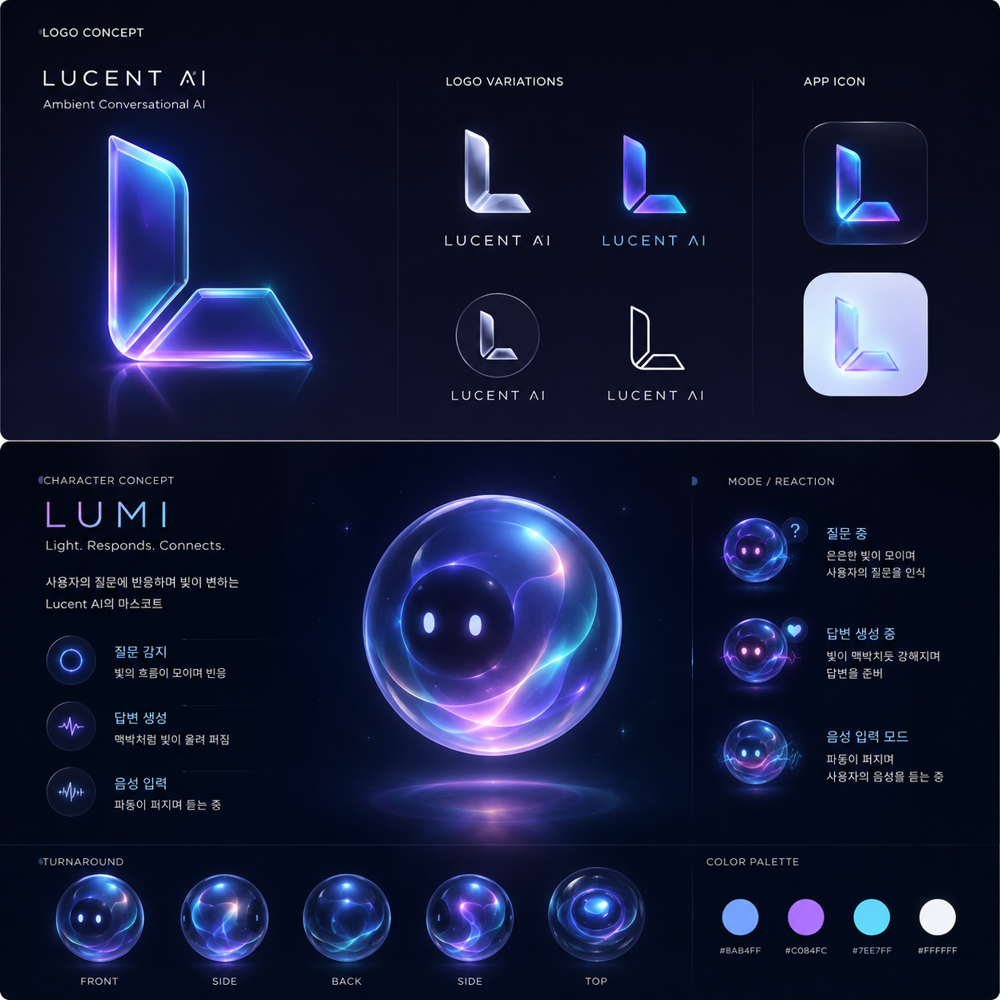
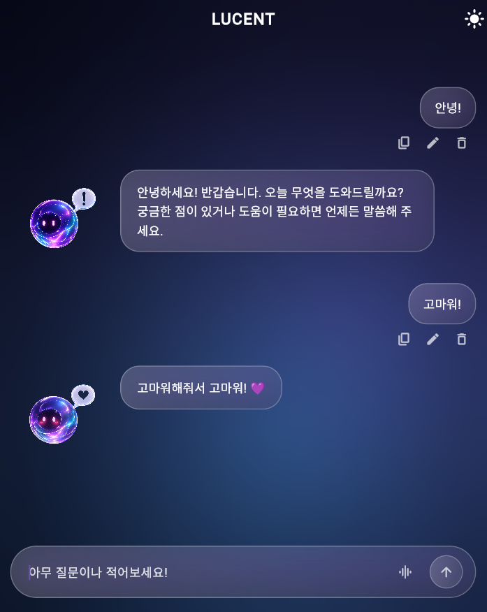
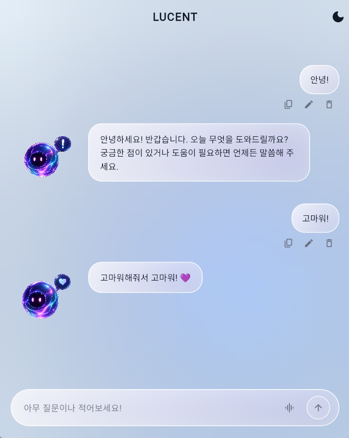

# LUCENT AI

> Ambient Conversational AI Agent

사용자의 흐름과 감정 상태에 반응하는
인터랙션 중심 AI Agent 프로젝트



---

## Overview

LUCENT는 단순한 AI 챗봇이 아닌,
사용자의 상태와 대화 흐름에 따라
시각적으로 반응하는 Ambient AI Agent입니다.

Glassmorphism 기반 인터페이스와
감정형 캐릭터 인터랙션을 통해
"살아있는 AI 경험"을 구현했습니다.

---

## Core Experience

- Ambient Aurora Background
- Reactive AI Emotion States
- Glassmorphism Chat Interface
- Voice Interaction Mode
- Dynamic Typing Animation
- Light / Dark Mode
- Emotional Character System

---

## Character States

| State | Emotion |
|---|---|
| Thinking | ❔ |
| Answering | 💜 |
| Complete | ❕ |
| Listening | 🎧 |
| Error | ⚠️ |

---

## UI System

### Glassmorphism

- Dynamic blur layers
- Reactive glow border
- Soft transparency interaction

### Ambient Motion

- Aurora animated background
- Pulsating glow animation
- Voice wave interaction
- Smooth conversational transition

---

## Tech Stack

| Category | Stack |
|---|---|
| Framework | Flutter |
| Language | Dart |
| AI | Gemini API |
| State | Stateful Widget |
| Animation | Custom Animation Controller |
| Environment | flutter_dotenv |

---

## Project Structure

```bash
lib/
├── main.dart
├── model.dart
assets/
├── character/
├── logo/
└── ui/
```

---

## Setup

Create `.env`

```env
GEMINI_API_KEY=your_api_key
```

Install packages

```bash
flutter pub get
```

Run

```bash
flutter run -d chrome
```

---

## Vision

LUCENT explores how conversational AI can evolve from
a simple chatbot into an emotionally reactive ambient interface.

---

## Preview

### Main Interface

<p align="center">
  
  
</p>

### Emotion Interaction
<p align="center">
  
</p>
---

## Author

Chaewon Kim

